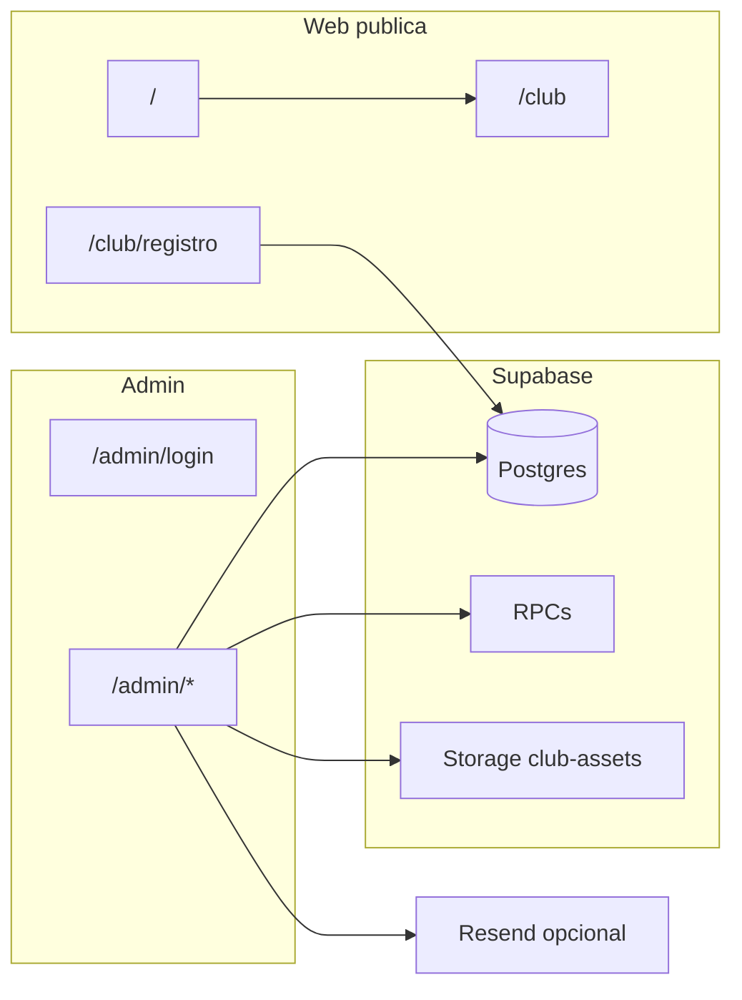

# Contexto de la aplicación — Club OS

Documento de referencia del estado actual del proyecto: alcance funcional, organización del código, datos en Supabase e integraciones. Incluye una sección de **pendientes a revisar** con hallazgos dudosos o no versionados en el repositorio.

---

## Propósito del producto

**Club OS** es una aplicación web para la operación diaria de un club deportivo o social:

- Alta y gestión de **socios** (estado pendiente / activo).
- **Grupos** (disciplinas, comisiones, etc.) y relación socio–grupo.
- **Cargos y cobranzas**: conceptos por socio o totales, cuota mensual institucional (`membership`), pagos parciales y métodos de pago.
- **Egresos / movimientos** vinculables opcionalmente a un cargo.
- **Dashboard** con métricas de socios, deuda, ingresos por pagos, egresos y proyecciones.
- **Superficie pública**: landing de producto en `/`, experiencia “demo club” en `/club` y **registro web** de socios que persiste en Supabase.

---

## Stack técnico

| Capa | Tecnología |
|------|------------|
| Framework | Next.js 16 (App Router), React 19 |
| Estilos | Tailwind CSS 4 |
| Lenguaje | TypeScript |
| Base de datos / backend | Supabase (Postgres + API + Storage) |
| Email | Resend |
| PDF | jsPDF (`src/lib/generate-receipt-pdf.ts`) |

### Arquitectura de datos (alto nivel)

- El cliente de Supabase en navegador y el “server client” usan la **misma clave anónima** (`NEXT_PUBLIC_SUPABASE_ANON_KEY`). No hay uso de service role en el código del repo.

---

## Mapa de rutas

### Público — `src/app/(public)/`

| Ruta | Descripción |
|------|-------------|
| `/` | Landing de marketing del producto (beneficios, módulos, enlaces a demo). |
| `/registro` | Redirección a `/club/registro`. |

### Club (demo institucional) — `src/app/club/`

| Ruta | Descripción |
|------|-------------|
| `/club` | Página del club (contenido y componentes de marca). |
| `/club/registro` | Formulario de alta de socio; llama a `insertMember` en Supabase con `status: "pending"`. |
| `/club/proyectos/[slug]` | Páginas de proyectos por slug (contenido estático/configurado). |

Archivos de apoyo: `src/app/club/content.ts` (contenido), componentes bajo `src/components/club/` y marketing bajo `src/components/marketing/`.

### Administración — `src/app/(admin)/`

| Ruta | Descripción |
|------|-------------|
| `/admin/login` | Login local (ver pendientes de seguridad). |
| `/admin` | Dashboard principal (`src/lib/dashboard.ts`). |
| `/admin/socios` | Listado de socios, búsqueda, activación, vista de deuda agregada. |
| `/admin/socios/[id]` | Reexporta el mismo módulo que `/admin/members/[id]`. |
| `/admin/members/[id]` | Ficha del socio: datos, grupos, cargos, cuota mensual, edición. |
| `/admin/groups` | Listado y creación de grupos. |
| `/admin/groups/[id]` | Detalle del grupo y socios vinculados. |
| `/admin/charges` | Listado de cargos. |
| `/admin/charges/[id]` | Detalle del cargo, finanzas, asignación a socios, pagos. |
| `/admin/expenses` | Movimientos / egresos. |
| `/admin/settings` | Ajustes del club (nombre, cuota, colores, alias de pago, logo, toggle de email de confirmación, test de Resend). |

**Protección de rutas admin:** `src/app/(admin)/layout.tsx` comprueba `localStorage.getItem("isAdminLogged") === "true"` y redirige a `/admin/login` si no hay sesión.

---

## Panel administrativo — funcionalidades resumidas

La navegación lateral está definida en `src/components/admin/admin-shell.tsx`:

- **Dashboard** — KPIs: socios activos/pendientes, deuda total, desglose cuota vs otros conceptos, ingresos del mes por `charge_payments`, egresos, balance, series recientes, socios con mayor deuda.
- **Socios** — Listado desde `listMembers`, actualización de estado (`updateMemberStatus`), balances por tipo de cargo (`listMemberChargeBalancesSplit`).
- **Grupos** — CRUD y conteo de miembros (`src/lib/groups.ts`).
- **Cargos** — Alta/listado de cargos, tipos `per_member` / `total`, relación con definiciones y grupos; detalle con RPCs de finanzas y asignación; registro de pagos vía modal (`ChargePaymentModal`) y RPC `register_charge_payment`.
- **Movimientos** — Gastos con categoría, fecha y opcional `charge_id` (`src/lib/expenses.ts`).
- **Ajustes** — Persistencia en `club_settings`; subida de logo a bucket `club-assets` (`src/lib/club-logo.ts`).

Componentes admin relevantes: `member-charges-section`, `member-groups-section`, `membership-monthly-section`, `charge-payment-modal`, `club-logo-upload`, etc.

---

## Configuración activa del club

1. **Fallback local** — `src/config/club.ts` (nombre, cuota, colores, logo por defecto).
2. **Fusión con BD** — `src/config/active-club.ts` lee `club_settings` con `getClubSettings()` y construye `ActiveClubConfig` (incluye `payment_alias`, `monthly_due_day`).
3. **Cliente** — `src/config/use-active-club-config.ts` expone la configuración en componentes `"use client"`.

Si no hay fila en `club_settings` o hay error de red, se usa el fallback.

---

## Capa de datos en el frontend

### `src/lib/supabase.ts`

- Define el tipo **`Database`** (tablas, vistas y funciones RPC esperadas).
- **Socios:** `insertMember`, `listMembers`, `getMemberById`, `updateMember`, `updateMemberStatus`.
- **Club:** `getClubSettings`, `saveClubSettings`, `updateClubSettingsById`.
- Cliente singleton `getSupabaseClient()` con variables `NEXT_PUBLIC_SUPABASE_*`.

### `src/lib/supabase-server.ts`

- `getSupabaseServerClient()` — mismo patrón de URL + anon key (útil para Server Components o rutas si se extendiera el uso).

### `src/lib/charges.ts`

- Modelos y consultas sobre `charges`, `charge_definitions`, `member_charges`, `charge_payments`.
- **RPC:** `register_charge_payment`, `get_charge_financials`, `charge_has_payments`, `assign_charge_to_missing_members`.
- Utilidades: categorías (`membership`, etc.), formato de período de facturación, listados para UI y exportes.

### Otros módulos

- `src/lib/groups.ts` — grupos y `member_groups`.
- `src/lib/expenses.ts` — egresos y join con `charges`.
- `src/lib/dashboard.ts` — agregaciones para el dashboard.
- `src/lib/whatsapp-reminder.ts` — texto / flujo de recordatorios (WhatsApp).
- `src/lib/formatters.ts`, `src/lib/datetime.ts`, `src/lib/ui-messages.ts` — utilidades de presentación.
- `src/lib/email.ts` — envío de email de confirmación de pago (Resend); **ver pendientes** (no cableado al flujo de pago).
- `src/lib/generate-receipt-pdf.ts` — generación de PDF de comprobante; **ver pendientes** (sin referencias en otros archivos del `src` al momento de redactar este documento).

### Tipos compartidos

- `src/types/index.ts` — p. ej. tipo `Member`.

---

## Supabase en el repositorio (migraciones SQL)

Las migraciones viven en `supabase/migrations/`. **No incluyen la creación del esquema base** (tablas `members`, `charges`, `club_settings`, etc.): el código TypeScript las asume; el esquema completo puede existir solo en el proyecto Supabase remoto o en migraciones no commiteadas.

### Resumen por archivo

1. **`20260407140000_charge_definitions_and_rpc_placeholders.sql`**
   - Tabla `charge_definitions`.
   - Columna `charges.charge_definition_id` (FK).
   - `charges.group_id` pasa a ser nullable (cargos a nivel club).
   - Comentarios sobre RPCs `generate_monthly_charges` / `assign_charges_to_members` (placeholders históricos).

2. **`20260410120000_charges_billing_period_duplicate_guard.sql`**
   - Columna `charges.billing_period`.
   - Trigger `charges_skip_dup_def_period`: evita insertar duplicados misma definición + mismo período.

3. **`20260417090000_membership_automation.sql`**
   - Enriquece `charge_definitions` (monto, tipo, recurrencia, alcance, etc.) y `charges.generated_at`.
   - Funciones: `first_day_of_month`, `first_day_of_next_month`, `ensure_membership_charge_definition`, `generate_monthly_membership_charges`, `generate_membership_charges_range`, `update_future_unpaid_membership_charges`.
   - Trigger tras cambios en `club_settings` que sincroniza definición de cuota y regenera/actualiza cargos futuros.
   - `generate_monthly_charges()` redefinida para delegar en `generate_membership_charges_range` (ventana anual desde el mes siguiente).
   - `assign_charges_to_members()` como **stub** (cuerpo vacío).
   - Uso de extensión **pg_cron** y job programado `generate-yearly-membership-charges` (1 de enero).
   - Al final, ejecuta seeds lógicos (`ensure_membership_charge_definition`, etc.).

4. **`20260418103000_add_charge_payment_method.sql`**
   - Columna `charge_payments.payment_method` con check `cash` | `transfer` | `mercadopago`.
   - Función `register_charge_payment(..., p_payment_method)` con validación y actualización de `member_charges`.

### Storage

- El código espera un bucket **`club-assets`** y path fijo para el logo (`src/lib/club-logo.ts`). Las políticas de Storage no están en el repo.

---

## API routes (Next.js)

| Ruta | Método | Descripción |
|------|--------|-------------|
| `/api/test-email` | GET | Envía un email de prueba con Resend; requiere `RESEND_API_KEY` y `RESEND_TEST_TO_EMAIL`. |

---

## Variables de entorno

| Variable | Uso |
|----------|-----|
| `NEXT_PUBLIC_SUPABASE_URL` | Cliente Supabase |
| `NEXT_PUBLIC_SUPABASE_ANON_KEY` | Cliente Supabase |
| `RESEND_API_KEY` | Envío de correos |
| `RESEND_FROM_EMAIL` | Remitente (default en código si falta) |
| `RESEND_TEST_TO_EMAIL` | Destino del test en `/api/test-email` |

---

## Pendientes a revisar

Estos puntos surgen de cruzar el frontend, los tipos TypeScript y las migraciones presentes en el repo. Conviene validarlos en el panel de Supabase y en pruebas end-to-end.

| Tema | Motivo |
|------|--------|
| **Seguridad del admin** | Login en `src/app/(admin)/admin/login/page.tsx` con credenciales fijas (`admin` / `1234`) y sesión solo en `localStorage`. Sin Supabase Auth ni protección en servidor de las rutas `/admin/*`. |
| **RLS y clave anónima** | Toda la app usa la **anon key** también desde el cliente. No hay políticas RLS en el repo; hay que confirmar en Supabase que insert/select/update estén acotados (registro público, panel, storage). |
| **RPCs / vistas sin SQL en el repo** | `Database` en `src/lib/supabase.ts` declara p. ej. `get_charge_financials`, `charge_has_payments`, `assign_charge_to_missing_members`, vista `member_payment_summary`. Esas definiciones **no** están en `supabase/migrations/` — riesgo de desalineación con la BD real. |
| **Email tras cobro** | Existe `send_payment_confirmation_email` en ajustes y `sendPaymentConfirmationEmail` en `src/lib/email.ts`, pero el registro de pagos no invoca ese envío; solo hay prueba vía `/api/test-email`. |
| **Logo cuando `logo_url` está vacío** | En `src/config/active-club.ts`, un `logo_url` vacío puede dejar `logo: ""` y anular el fallback del spread. Revisar coalescencia con `fallbackClubConfig.logo`. |
| **Stub `assign_charges_to_members`** | La función en migración solo hace `return;` — nombre sugiere lógica pendiente o legacy. |
| **pg_cron** | Depende del plan y permisos de Supabase; el job puede no aplicarse o fallar en algunos entornos. |
| **Registro público** | `insertMember` se ejecuta desde el navegador; la seguridad depende enteramente de RLS sobre `members`. |
| **PDF de comprobante** | `generateReceipt` en `src/lib/generate-receipt-pdf.ts` no tiene imports desde otros archivos del `src` revisados; confirmar si debe integrarse en el flujo de pagos o eliminarse si es código muerto. |

---

## Referencias rápidas de archivos

- App Router: `src/app/`
- Admin layout y auth: `src/app/(admin)/layout.tsx`
- Cliente y tipos Supabase: `src/lib/supabase.ts`
- Migraciones: `supabase/migrations/`
- Navegación admin: `src/components/admin/admin-shell.tsx`

---

*Última actualización alineada al código del repositorio Club OS (revisión estática).*
